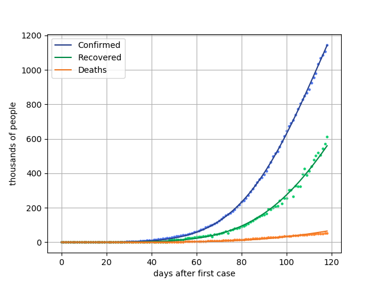

# Introduction

Many research teams seek to find an epidemiological model that can describe the spread of SARS-CoV-2. Many gaps in knowledge about the biology of the virus, the difference in social patterns and public policies by countries around the world combined with the many testing approaches causes that the breadth and shape of infection curves do not assume a global behavioral pattern.

If, on the one hand, it is difficult to say precisely which is the best theory, on the other, it is a fact that the direction of public policies depends on future projections of the data observed until then, by applying minimally satisfactory models. This condition motivates researchers to formulate increasingly more intricate models that, although not applicable to all countries of the globe, are quite credible locally. In general, they have a large number of free parameters and differential equations, which makes them inaccessible outside the professional environment.

In this work, a toy model is presented to describe Covid infection data in Brazil during the months of February 2020 until the first week of June 2020. This is based on a SIRD model, with the addition of a parameter for enable its compatibility with the data. This model describes the interaction of four time functions $S\left(t\right)$, $I\left(t\right)$, $R\left(t\right)$ and $D\left(r\right)$ that counts the susceptible, active infected, recovered and dead individuals in a specific population. The differential equations are:

$$\frac{dS}{dt}	=-\frac{\beta}{s_{0}}s\left(t\right)i\left(t\right)^{\alpha};$$ 
$$\frac{dI}{dt}	=\left(\frac{\beta}{s_{0}}s-\rho-\delta\right)i\left(t\right)^{\alpha};$$ 
$$\frac{dR}{dt}	=\rho\,i\left(t\right)^{\alpha};$$ and
$$\frac{dD}{dt}	=\delta\,i\left(t\right)^{\alpha}.$$ 
Notice that:$$\frac{dS}{dt}+\frac{dI}{dt}+\frac{dR}{dt}+\frac{dD}{dt}=0.$$This equations must be integrated with inicial conditions given by: $S\left(0\right)=s_{0}$ , $I\left(0\right)=1$ and $R\left(0\right)=D\left(0\right)=0$. The time variable $t$ is defined as the time after first confirmed case. The model have five free parameters $\left(\alpha,\beta,\rho,\delta,s_{0}\right)$, where $s_{0}$ is the initial susceptible individuals. Inthe case where $\alpha=1$, the SIRD model is recovered. As $s_{0}$, in general, assumes very large values, lets consider its log value. In this way, the parameters are $\left(\alpha,\beta,\rho,\delta,\log_{10}s_{0}\right)$

